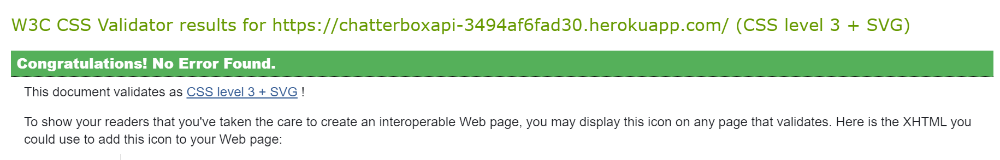

# Chatterbox

Chatterbox is a social media site for sharing images where users can follow and comment on all content in an unrestrcited manor.
<br>
The live link can be found here: [Live Site - Chatterbox](https://chatterboxapi-3494af6fad30.herokuapp.com/)
<br>

### Site Goals
Chatterbox is a site for everyone to post their favourite photos and maybe find new people to follow based on the content they are providing.

### Agile Planning
This project was developed utilising agile principles where features were added in small, incremental sprints over numerous weeks.

<hr>

## Epics

**Set up**
This Epic focused on the backend portion of the project with the Django Rest Framework being implemented for the API.

**Posts**
This Epic covers the API endpoint creation and database connections relating to the CRUD functionality of user posts, which includes like activity.

**Comments**

This Epic covers all API endpoint creation and database connections relating to the CRUD functionality of user comments in relation to posts.

**Profiles**

This Epic covers all API endpoint creation and database connections relating to the CRUD functionality of user created profiles, which includes follow/unfollow functionality.

**Contact**

This Epic covered the API endpoint creation and database connection relating to the functionality of user contact in relation to app performance.

<br>

### User Stories
**Setup**
* As a developer, I need to create the backend in order to have features present for users on the site
* As a developer, I need to create a connection to Cloudinary so static images can be uploaded
* As a user, I want to be able to create an account and have access to features on the site
* As a user, I want to be able to browse the app on any size of device

**Posts**
* As a user, I want to be able to create, view, edit or delete a post
* As a user, I want to be able to keep scrolling through the images on the site, so they're loaded for me automatically
* As a user, I want to be able to filter results based on the profiles I follow so I can keep up to date with their content
* As a logged in user, I want to be able to view content I've liked
* As a user, I want to see posts created most recently
* As a user, I want to be able to see details of a single post

**Profiles**
* As a developer, I want a user to have a blank profile page with a default avatar photo when its created by any user
* As a user, I want to see other profiles that have been created and the posts they've shared
* As a user, I can view a user's avatars so that I can easily identify users of the app
* As a user, I can tell if I am logged in or not so that I can log in if I need to
* As a user, I can see a list of the top five most followed profiles so that I can see which profiles are popular
* As a user, I can view statistics about a specific user: bio, number of posts, follows and users followed so that I can learn more about them
* As a logged in user, I can follow and unfollow other users so that I can see and remove posts by specific users in my posts feed
* As a logged in user, I can edit my profile so that I can change my profile picture and bio
* As a logged in user, I can update my username and password so that I can change my display name and keep my profile secure

**Comments**
* As a logged in user, I can add comments to a post and engage with others
* As a user, I can see how long ago a comment was made
* As a user, I can read comments on posts
* As an owner of a comment I can delete it
* As an owner of a comment I can edit my comment so that I can fix or update my existing comment

**Contact**
* As a user, I would like to be able to contact the site owner in case I have any issues or queries.

**Rating**

As a logged in user, I can rate the photo selection in the horizontal scroll container on the profile page.

<hr>

### API Endpoints
User story
`As a developer, I need to create a base project set up so that I can build out the features that will be shown on the frontend.`

Implementation:

The project was created with all neccessary packages installed and frozen into the requirements.

The settings were also edited to hide any secret variables and set dev and production environments apart.

User Story
`As a developer, I have to connect Cloudinary to the project so static images can be uploaded by the users`

Implementation:
A Cloudinary account was created, the API environment was added to the settings file to ensure photos could be uploaded

User Story
`As a user I can create a new account so that I can access all the features for signed up users`

Implementation:
Django rest framework and dj_rest_auth were installed and added to the url patterns and site packages to make use of their built in authentication system

User Story:

`As a user, I want to be able to view create, edit or delete a post`

Implementation:

Endpoint: /posts/

Methods:
* POST - Used to create post
* GET - Used to get a list of posts

Endpoint: /posts/<int:pk>/

Methods:
* GET - Get a single post
* PUT - Used to update a single post
* DELETE - Used to delete a post

<hr>

## Features
**Setup**

User Story:

`As a user, I would like a favicon on the website so that I can easily know which tab belongs to Chatterbox`

Implementation:

A site favicon was implemented with the sites logo. This will allow users to easily identify Chatterbox when they have multiple tabs open.

User Story:

`As a logged out user I can see login and register options so that I can login/register`

Implementation:

Checks were implemented to detect when a user is signed in or signed out and which nav items were then displayed. This will prevent users from being able to click buttons from the UI in order to reach restricted pages. Redirects on the URLS was also implemented to ensure users cannot access pages when logged out if they are for logged in users only.

User Story:

`As a user, I would like a fully responsive navigation menu so that I can easily access Chatterbox from any device`

Implementation:

A navigation menu was implemented that collapses into a hamburger menu on smaller devices.
This will ensure that no navigation items overlap and users can access and navigate the site from any size device.

**Navigation Menu**

User Stories:

` As a logged out user I can see login and register options, as well as the Chatterbox logo`

Implementation:

A fully responsive navigation menu has been implemented across the website.

This will allow users to navigate to different pages on the app with ease from any device. Nav items are different depending on the users logged in status to prevent them accessing areas of the app intended for signed in users.

Logged in users:

When a user is logged in, the following navigation items are displayed:
* Chatterbox Logo
* Create Post
* Contact Us
* Feed
* Liked
* Sign Out
* Profile
[!Navbar](docs/nav_logged_in.png)

Logged out users:

When a user is logged out, the following navigation items are displayed:
* Chatterbox logo
* Login
* Register
[!Navbar](docs/nav_logged_out.png)

**Home**

User Story:

`As a user, I can view all the most recent posts, with the most recently created first so that I am up to date with the newest content`

Implementation:

The home page displays user posts in order of newest posts first. These posts are visible to all users regardless of logged in status. This will allow non registered users to get a feel for the content on the site to know whether they are interested in signing up.

Restricted access has been implemented on the posts for users who are not signed in, they will not be able to like, comment or create a post.

**Posts**

User Story:

`As a user, I can keep scrolling through the images on the site because they are loaded for me automatically`

Implementation:

Infinite scrolling was implemented to load 10 posts at a time and when user reaches the end of the scroll, it will load 10 more and so on. This will allow for optimal load times to enhance viewing pleasure.

User Story:

`As a user, I can view all the most recent posts, ordered by most recently created first so that I am up to date with the newest content`

Implementaton:

The posts page, feed and liked pages are all ordered by newest content first. This will prevent users from being shown content they have already seen at the top and reduce the need for them to 'search' for new content.

User Story:

`As a user, I can view the details of a single post so that I can see if there has been any interaction with it by other users`

Implementation:

A post detail page has been added that is visible to all users, this will allow them to see the full post detail and comments.

User Stories:

`As a logged in user, I can like a post which shows I enjoyed that users post`

Implementation:

Logged in users have full access to post, comment, like or unlike. This will help ensure that unregistered users do not spam the website while also ensuring genuine users register to the site.

User Story:

`As a post owner I can edit my post title and description so that I can make corrections or update my post after it was created`

Implementation:

Only the user who created the post will be able to edit or delete a post. This will ensure that users have full control of their own posts and unauthorized users can't tamper with them.

User Story:

`As a logged in user, I can create posts so that I can share my images`

Implementation:

A create post button has been implemented in the navbar in order for logged in users to create a post when they want to share something.

User Story:

`As a logged in user, I can view content filtered by users I follow so that I can keep up to date with their posts`

Implementation:

Users can also click the Feed nav item and this will display posts from users the person has followed.

User Story:

`As a logged in user, I can view the posts I liked so that I can find the posts I enjoy the most`

Implementation:

Users can click the liked nav item and display all of the posts they have liked.

User Story:

`As a user, I can search for posts with keywords, so that I can find the posts and user profiles I am most interested in.`

Implementation:

A search bar has been added that will allow users to search for keywords so that they can search for content that interests them.

**Comments**

Below each post, there will be a comment box available to logged in users. This will allow users to add comments under posts.

A comment count will also be shown under the post, to allow users to see how many people have commented on each post.

A comment or updated time will be displayed in either minutes or days.

The username and Avatar of the user that created the comment will be displayed on each comment.

Comments are restricted to one hundred and fifty characters

**Profiles**

User Story:

`As a user, I can view other profiles so that I can see their posts and learn more about them`

Implementation:

Profile pages have been implemented and can be viewed by clicking on a users Avatar that is displayed on a post.

To view a users own profile, click on their own icon from the navigation menu.

User Stories:

`As a logged in user I can edit my profile so that I can change my profile picture and bio`

Implementation:

If the user is the owner of the profile, they are able to edit the profile via the profile form accessed via the three dot drop down menu on the profile.

User Story:

`As a logged in user, I can edit my username and password so that I can change my display name and keep my profile secure`

Implemenation:

The drop down menu also allows the user to edit their user name or password by clicking the menu options and filling in the forms.

User Story:

`As a user, I can tell if I am logged in or not so that I can log in if I need to`

Implementation:

When a user is logged in, their profile image is on display in the top right of the nav. This will allow the user to easily know when they are logged in.

User Story:

`As a logged in user, I can see the top images from posts`

Implementation:

When a logged in user is on their profile page, a horizontal scroll div will display six of the most popular photos chosen by the Chatterbox team.

**Most followed profiles**

User Stories:

`As a user, I can view all the posts by a specific user so that I can catch up on their latest posts, or decide if I want to follow them`

`As a user, I can see a list of the top five most followed profiles so that I can see which profiles are popular`

`As a user, I can view statistics about a specific user: bio, number of posts, follows and users followed so that I can learn more about them`

`As a logged in user I can follow and unfollow other users so that I can see and remove posts by specific users in my posts feed`


Implementation:

A component showing the most followed users is shown and the user profiles are able to be viewed by clicking on these. On a desktop, the most followed users has five users. On a mobile device this is restricted to four so that it does not take up too much room as scrolling may become an issue. A follow button will also be displayed.

## Database Design
## Security
A permissions class was added called IsOwnerOrReadOnly to ensure only users who create the content are able to edit or delete it.

## Technologies

* Django - Main framework used for application creation
* Django REST Framework - Used for creating the API
* Heroku - Used for hosting the application
* Git - Used for version control
* Github - Repository for storing code base and docs
<br>
## Python Packages
* Django
* dj-rest-auth
* dj-database-url
* django-allauth
* django-cors-headers
* django-filter
* django-storages
* djangorestframework
* djangorestframework-simplejwt
* gunicorn
* Pillow
* psycopg2
* PyJWT

Installed dependencies:
* Cloudinary

## User Stories Testing
## Auth

**Ensure a user can register**

  1. Navigate to Chatterbox
  2. Click Register
  3. Fill the required inputs
  4. Click register

Expected:
A user will be redirected to the login page

Result:
The new user is brought to the login page
<hr>

**Test if a user can login**

1. Navigate to Chatterbox
2. Click Login
3. Fill the required inputs
4. Click login

Expeceted:
A user will be redirected to the home page

Result:
The user will be redirected to the home page
<hr>

## Profiles
**Test if a user can edit their profile**

1. Go to profile page & click the three vertical dots
2. Click edit profile
3. Fill out the form
4. Change the image
5. Save it

Expected:
The profile will display the updated information

Result:
The user has updated their profile
<hr>

**Test if user can follow other profiles**

1. Click the follow button

Expected:
The user will be following the desired profile and the follow button will change to Unfollow

Result:
Everything works as it should
<hr>

**Ensure the unfollow button works**

1. Click the unfollow button

Expeceted:
The user will no longer be following the profile and the unfollow button will turn to follow

Result:
Everything works as it should
<hr>

**Test if user can change password**

1. Go to profile page & click the three vertical dots
2. Click change password
3. Fill out the form
4. Save it

Expeceted:
The user will have updated their password

Result:
Everything works as it should
<hr>

**Test if user can change username**

1. Go to profile page & click the three vertical dots
2. Click change username
3. Fill out the form
4. Save it

Expeceted:
The user will have updated their username

Result:
Everything works as it should
<hr>

**Test if horizontal scroll bar moves**

1. Go to profile page & locate the image container
2. Grab a photo and move it left or right
3. Photos should move and stay in the container

Expected:
The user will be able to grab a photo and flick between all photos in a horizontal fashion

Result:
Everything works as it should

**Test if rating component works**

1. Go to profile page & locate the stars below the horizontal image container
2. Hover over the stars and if the user is hovering over three stars then three stars will be filled and the number will update too
3. Click on the star to give a rating to the photo container
4. The number will stay at that rating while on the page

Expected:
A user can rate the horizontal image container by using the star rating component

Result:
Everything works as it should

**Ensure the popular profiles display**

1. Go to profile page

Expected:
The popular profile component will display on the right side of the screen

Result:
Everything works as it should

## Unit Testing
## Lighthouse

Lighthouse testing on the app showed accessibility, best practices and seo to be performing well but performance was poor.

<br>

## Responsiveness

All pages were tested to ensure they fit on every screen size, so any device from 285px and upwards.
The steps taken were:

1. Navigate to Chatterbox
2. Right click and inspect to open the developer tools
3. Test each page of the app on the devices from the drop down list

Expected:
The app will responsively adapt to the screen size with no horizontal scroll presenting itself or no overflowing images

Result:
The app behaved as expected

## Validators

All CSS files were check and validated on W3C CSS validator website:



## Deployment
## Version Control
The site was created using the Visual Studio Code editor and pushed to github.
The following git commands were used throughout development to push code to the remote repo:

```git add <file>``` - This command was used to add the file(s) to the staging area before they are committed.

```git commit -m “commit message”``` - This command was used to commit changes to the local repository queue ready for the final step.

```git push``` - This command was used to push all committed code to the remote repository on github.
<br>
## Heroku Deployment
The site was deployed to Heroku. The steps to deploy are as follows:

* Navigate to heroku and create an account
* Click the new button in the top right corner
* Select create new app
* Enter app name
* Select region and click create app
* Click the resources tab and search for Heroku Postgres
* Select hobby dev and continue
* Go to the settings tab and then click reveal config vars
* Add the following config vars:
  *
  *
  *
  *
* Click the deploy tab
* Scroll down to Connect to GitHub and sign in / authorize when prompted
* In the search box, find the repositoy you want to deploy and click connect
* Scroll down to Manual deploy and choose the main branch
* Click deploy
<br>


  
